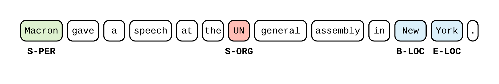

# Tensorflow - Named Entity Recognition

Each folder contains a __standalone__, __short (~100 lines of Tensorflow)__, `main.py` that implements a neural-network based model for Named Entity Recognition (NER) using [`tf.estimator`](https://www.tensorflow.org/guide/custom_estimators) and [`tf.data`](https://www.tensorflow.org/guide/datasets).




These implementations are __simple, efficient, and state-of-the-art__, in the sense that they do __as least as well as the results reported in the papers__. To my knowledge, *existing implementations available on the web are convoluted, outdated and not always accurate* (including my [previous work](https://github.com/guillaumegenthial/sequence_tagging)). This repo is an attempt to fix this, in the hope that it will not only trigger new ideas around NER, but more importantly make their implementation a lot easier.

The script [`lstm_crf/main.py`](https://github.com/guillaumegenthial/tf_ner/blob/master/lstm_crf/main.py) can also be seen as a __simple introduction to Tensorflow high-level APIs [`tf.estimator`](https://www.tensorflow.org/guide/custom_estimators) and [`tf.data`](https://www.tensorflow.org/guide/datasets) applied to Natural Language Processing__.


## Install

You need __python3__ -- If you haven't switched yet, do it.

You need to install [`tf_metrics` ](https://github.com/guillaumegenthial/tf_metrics) (multi-class precision, recall and f1 metrics for Tensorflow).

```
git clone https://github.com/guillaumegenthial/tf_metrics.git
cd tf_metrics
pip install -r requirements.txt
```

## Data Format

Follow the [`data/example`](https://github.com/guillaumegenthial/tf_ner/tree/master/data/example)

1. For `name` in `{train, testa, testb}`, create files `{name}.words.txt` and `{name}.tags.txt` that contain one sentence per line, each
word / tag separated by space. I recommend using the `IOBES` tagging scheme.
2. Create files `vocab.words.txt`, `vocab.tags.txt` and `vocab.chars.txt` that contain one token per line.
3. Create a `glove.npz` file containing one array `embeddings` of shape `(size_vocab_words, 300)` using [GloVe 840B vectors](https://nlp.stanford.edu/projects/glove/) and [`np.savez_compressed`](https://docs.scipy.org/doc/numpy-1.13.0/reference/generated/numpy.savez_compressed.html).

An example of scripts to build the `vocab` and the `glove.npz` files from the  `{name}.words.txt` and `{name}.tags.txt` files is provided in [`data/example`](https://github.com/guillaumegenthial/tf_ner/tree/master/data/example). See

1. [`build_vocab.py`](https://github.com/guillaumegenthial/tf_ner/blob/master/data/example/build_vocab.py)
2. [`build_glove.py`'](https://github.com/guillaumegenthial/tf_ner/blob/master/data/example/build_glove.py)


## Models

Took inspiration from these papers

- [Bidirectional LSTM-CRF Models for Sequence Tagging](https://arxiv.org/abs/1508.01991) by Huang, Xu and Yu
- [Neural Architectures for Named Entity Recognition](https://arxiv.org/abs/1603.01360) by Lample et al.
- [End-to-end Sequence Labeling via Bi-directional LSTM-CNNs-CRF](https://arxiv.org/abs/1603.01354) by Ma et Hovy

You can also read [this blog post](https://guillaumegenthial.github.io/sequence-tagging-with-tensorflow.html).

Word-vectors are not retrained to avoid any undesirable shift (explanation in [these CS224N notes](https://github.com/stanfordnlp/cs224n-winter17-notes/blob/master/notes2.pdf)).

The models are tested on the [CoNLL2003 shared task](https://www.clips.uantwerpen.be/conll2003/ner/).

Training times are provided for indicative purposes only. Obtained on a 2016 13-inch MBPro 3.3 GHz Intel Core i7.

For each model, we run 5 experiments

- Train on `train` only
- Early stopping on `testa`
- Select best of 5 on the perfomance on `testa`
- Report F1 score mean and standard deviation

---

### `lstm_crf`

__Architecture__

1. [GloVe 840B vectors](https://nlp.stanford.edu/projects/glove/)
2. Bi-LSTM
3. CRF

__Related Paper__ [Bidirectional LSTM-CRF Models for Sequence Tagging](https://arxiv.org/abs/1508.01991) by Huang, Xu and Yu

__Training time__ ~ 20 min

|| `train` | `testa` | `testb` | Paper, `testb` |
|---|---|---|---|---|
|best | 98.45 |93.81 | 90.61 |  |
|mean ± std| 98.85 ± 0.22| 93.68 ± 0.12| __90.42__ ± 0.10| 90.10  |


---

### `chars_lstm_lstm_crf`

__Architecture__

1. [GloVe 840B vectors](https://nlp.stanford.edu/projects/glove/)
2. Chars embeddings
3. Chars bi-LSTM
4. Bi-LSTM
5. CRF

__Related Paper__ [Neural Architectures for Named Entity Recognition](https://arxiv.org/abs/1603.01360) by Lample et al.

__Training time__ ~ 35 min

|| `train` | `testa` | `testb` | Paper, `testb` |
|---|---|---|---|---|
|best| 98.81 | 94.36 | 91.02 |  |
|mean ± std | 98.83 ± 0.27| 94.02 ± 0.26| __91.01__ ± 0.16 | 90.94 |


---

### `chars_conv_lstm_crf`

__Architecture__

1. [GloVe 840B vectors](https://nlp.stanford.edu/projects/glove/)
2. Chars embeddings
3. Chars 1d convolution and max-pooling
4. Bi-LSTM
5. CRF

__Related Paper__ [End-to-end Sequence Labeling via Bi-directional LSTM-CNNs-CRF](https://arxiv.org/abs/1603.01354) by Ma et Hovy

__Training time__ ~ 35 min

|| `train` | `testa` | `testb` | Paper, `testb` |
|---|---|---|---|---|
|best| 99.16 | 94.53 | 91.18 |  |
|mean ± std | 98.86 ± 0.30| 94.10 ± 0.26| __91.20__ ± 0.15 | 91.21 |


