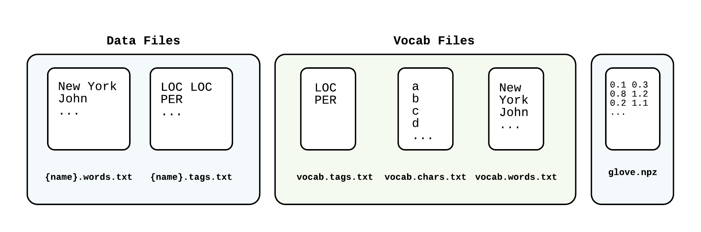

# bi-LSTM + CRF

__Architecture__

1. [GloVe 840B vectors](https://nlp.stanford.edu/projects/glove/)
2. Bi-LSTM
3. CRF

__Related Paper__ [Bidirectional LSTM-CRF Models for Sequence Tagging](https://arxiv.org/abs/1508.01991) by Huang, Xu and Yu

__Training time__ ~ 20 min

|| `train` | `testa` | `testb` | Paper, `testb` |
|---|:---:|:---:|:---:|:---:|
|best | 98.45 |93.81 | __90.61__ |  90.10 |
|best (EMA)| 98.82 | 94.06 | 90.43 | |
|mean ± std| 98.85 ± 0.22| 93.68 ± 0.12| 90.42 ± 0.10|  |
|mean ± std (EMA)| 98.71 ± 0.47 | 93.81 ± 0.24 | __90.50__ ± 0.21| |
|abs. best |   | | 90.61 |  |
|abs. best (EMA) | |  | 90.75 |  |


## 1. Format your data to the right format

Follow the [`data/example`](https://github.com/guillaumegenthial/tf_ner/tree/master/data/example) and add your data to `data/your_data` for instance.

1. For `name` in `{train, testa, testb}`, create files `{name}.words.txt` and `{name}.tags.txt` that contain one sentence per line, each
word / tag separated by space. I recommend using the `IOBES` tagging scheme.
2. Create files `vocab.words.txt`, `vocab.tags.txt` and `vocab.chars.txt` that contain one lexeme per line.
3. Create a `glove.npz` file containing one array `embeddings` of shape `(size_vocab_words, 300)` using [GloVe 840B vectors](https://nlp.stanford.edu/projects/glove/) and [`np.savez_compressed`](https://docs.scipy.org/doc/numpy-1.13.0/reference/generated/numpy.savez_compressed.html).

An example of scripts to build the `vocab` and the `glove.npz` files from the  `{name}.words.txt` and `{name}.tags.txt` files is provided in [`data/example`](https://github.com/guillaumegenthial/tf_ner/tree/master/data/example). See

1. [`build_vocab.py`](https://github.com/guillaumegenthial/tf_ner/blob/master/data/example/build_vocab.py)
2. [`build_glove.py`'](https://github.com/guillaumegenthial/tf_ner/blob/master/data/example/build_glove.py)



If you just want to get started, once you have created your `{name}.words.txt` and `{name}.tags.txt` files, simply do

```
cd data/example
make download-glove
make build
```

## 2. Update the `main.py` script

Change the relative path `DATADIR` from the `main.py` script to the directory containing your data.

For example, `DATADIR = '../../data/your_data'`.


## 3. Run `python main.py`

Using python3, it will run training with early stopping and write predictions under `results/score/{name}.preds.txt`.

## 4. Run the `conlleval` script on the predictions

Usage: `../conlleval < results/score/{name}.preds.txt > results/score/score.{name}.metrics.txt`

## 5. Run `python interact.py`

It reloads the trained estimator and computes predicitons on a simple example

## 6. Run `python export.py`

It exports the estimator inference graph under `saved_model`. We will re-use this for serving.

## 7. Run `python serve.py`

It reloads the saved model using `tf.contrib.predictor` and computes prediction on a simple example.
